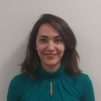

## Zahra Ghodsi

I am a PhD candidate at New York University, advised by [Siddharth Garg](http://wp.nyu.edu/ensure_group/). My research interests include Security, Privacy, Machine Learning, and everything in between. My research is partially supported by a J.P. Morgan AI Research Fellowship. 

Previously, I received a M.Sc. in Computer Engineering from NYU, and a B.Sc. in Electrical Engineering from Sharif University of Technology.

---

### News
**Sep 2020** Our paper, "CryptoNAS: Private Inference on a ReLU Budget", has been accepted to NeurIPS 2020.

**Sep 2019** I will be joining NVIDIA Research for an internship, thrilled to be working with [Anima Anandkumar](https://research.nvidia.com/person/anima-anandkumar).

**Jan 2019** I have been selected as a [J.P. Morgan AI Research PhD Fellow](https://www.jpmorgan.com/country/US/en/technology/ai/awards/phd-fellowship-award-recipients).

